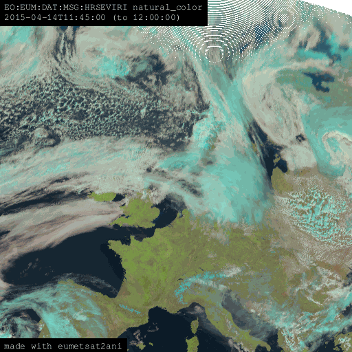

# eumetsat2ani



Create animations directly from EUMETSAT data from the command line:

```bash
python -m eumetsat2ani \
    --api-key <eumetsat-api-key> \
    --api-secret <eumetsat-api-secret> \
    --collection-name EO:EUM:DAT:MSG:HRSEVIRI \
    --t-start 2015-04-14T09:00:00 \
    --t-end 2015-04-14T12:00 \
    --area euro \
    --product natural_color
```

To get your API keys for EUMETSAT you will need to create an account and go to https://api.eumetsat.int/api-key/.

## Installation

`eumetsat2ani` can be installed directly with `pip`

```bash
python -m pip install eumetsat2ani
```


## Usage

```bash
python -m eumetsat2ani --help
usage: __main__.py [-h] --api-key str --api-secret str [--collection-name str] [--t-start parse_datetime] [--t-end parse_datetime] [--area str] [--root-data-path Path] [--product str] [--launch-ipdb-on-error]
                   [--frame-duration float]

options:
  -h, --help            show this help message and exit
  --api-key str         EUMETSAT API key (default: None)
  --api-secret str      EUMETSAT API secret (default: None)
  --collection-name str
                        EUMETSAT collection name (default: EO:EUM:DAT:MSG:HRSEVIRI)
  --t-start parse_datetime
                        Start time (default: 2015-04-14T09:00:00)
  --t-end parse_datetime
                        End time (default: 2015-04-14T13:00:00)
  --area str            Area definition (using satpy's inbuilt area definitions) (default: euro)
  --root-data-path Path
                        Root path to store downloaded data (default: data)
  --product str         Satpy product to render (default: natural_color)
  --launch-ipdb-on-error
                        Launch ipdb on error (default: False)
  --frame-duration float
                        Duration of each frame in seconds (default: 0.5)
```


# Inspiration

- https://eumetsatspace.atlassian.net/wiki/spaces/EUMDAC/pages/1760198661/Python+Library
- https://gitlab.eumetsat.int/eumetlab/data-services/eumdac_data_store
